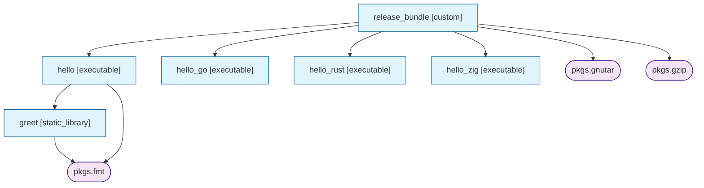

# rigx

<p align="center"></p>

> **Status: experimental.** This is an early version
> APIs, the `rigx.toml` schema, and CLI behavior may change without
> notice. If you use it, please report issues, but don't rely on it
> for production builds yet.

A small build system for C, C++, Go, Rust, Zig, Nim, and Python (and
anything else you can script). You list your targets and their sources in
`rigx.toml`, run `rigx build`, and get reproducible binaries — the compiler
and every library come from a pinned snapshot, so the same command produces
the same bytes on your laptop, your CI, and your colleague's machine. No
`apt install`, no Docker, no version drift.

Under the hood rigx writes a Nix flake and lets Nix do the work. You don't
have to know any of that — install Nix once and forget about it.

## A taste, if you've used Make or Bazel

```make
# Makefile
CXX = g++
CXXFLAGS = -std=c++17 -O2

hello: src/main.cpp src/greet.cpp
	$(CXX) $(CXXFLAGS) -o hello $^
```

```python
# BUILD.bazel
cc_binary(
    name = "hello",
    srcs = ["src/main.cpp", "src/greet.cpp"],
    copts = ["-std=c++17", "-O2"],
)
```

```toml
# rigx.toml
[project]
name = "hello"

[targets.hello]
kind     = "executable"
sources  = ["src/main.cpp", "src/greet.cpp"]
cxxflags = ["-std=c++17", "-O2"]
```

```
rigx build hello              # builds in a sandbox
./output/hello/bin/hello      # run it
```

What's different:

- You describe **what to build**, not the recipe — closer to Bazel's
  `cc_binary` than Make's `$(CXX) ... $^` block. `kind = "executable"` tells
  rigx how to compile a C++ program.
- The compiler and any `deps.nixpkgs = ["fmt"]` libraries come from a pinned
  `nixpkgs` — not your `$PATH` (Make) and not Bazel's host toolchain. First
  build pulls them; later builds use the Nix store cache.
- Outputs live in `/nix/store/...` and `output/hello` is a symlink to the
  current build. `rigx clean` removes the symlink; the store entry persists
  and gets reused next time.
- No `.PHONY`, no `genrule` — for side-effecting tasks (publish, deploy, run
  a script) use `kind = "script"` and `rigx run <name>`.
- Need a different language? Just drop `.go`, `.rs`, `.zig`, or `.nim`
  files into `sources` — language is inferred from the extension, the
  toolchain comes from nixpkgs, and you get the same `kind = "executable"`
  shape. Use `kind = "python_script"` for Python; `kind = "custom"` for
  project-managed builds (Cargo workspaces, `cmake`, …).
- `rigx.toml` is pure data — no Starlark, no Make macros. Sharing values
  across targets is `[vars]`; sharing across folders is `[modules]` or
  `[dependencies.local.*]` (see below).

## Features

- **TOML target declarations**: inputs, outputs, internal and external deps.
- **External deps** via pinned `nixpkgs` or `git` flake inputs.
- **Lock file** (`flake.lock`) pins every input revision.
- **Sandboxed builds**: compilation never touches the local filesystem; each
  derivation runs against the Nix store's layered filesystem.
- **Outputs** only appear under `output/` as symlinks into the Nix store.
- **Parameterized targets** via variants (e.g. `debug` / `release`).
- **Multi-language, first-class**: C, C++, Go, Rust, Zig, Nim, Python — pick
  by extension or set `language = "..."` explicitly. Anything else (Cargo
  workspaces, `cmake`, custom build pipelines) goes through `kind = "custom"`.
- **Cross-compilation** built in: `target = "aarch64-linux"` (or
  `armv7-linux`, `x86_64-windows`, …) routes c/cxx through `pkgsCross.<x>`,
  sets `GOOS`/`GOARCH` for Go, passes `-target` to Zig, auto-emits a `zigcc`
  shim for Nim. Combine with variants for one-source / multi-platform builds.
- **Multi-folder projects**: split a project into subfolders via
  `[modules]` (merged into one flake) or `[dependencies.local.*]` (each
  subfolder is its own flake, parent depends on built artifacts).
- **Sharable vars** (`[vars]` + `extends`) keep flag/source/dep lists
  DRY across targets and across files.
- **Built-in workflow tools**: `rigx watch` (rebuild on change),
  `rigx test` (discover-and-run `kind = "test"` targets), `rigx new`
  (scaffold a target + stub source), `rigx fmt` (canonical TOML),
  `rigx graph` (Mermaid dep graph), `rigx build --json` (CI-friendly output).

## Requirements

- [Nix](https://nixos.org/download) 2.4+ with flakes enabled (rigx passes
  `--extra-experimental-features "nix-command flakes"` automatically). This is
  the **only** tool you must install on the host — everything else
  (toolchains, `uv`, language-specific interpreters, …) comes from nixpkgs on
  demand and is pinned in `flake.lock`.

Python is provided by whatever channel you use to install rigx (PyPI install
methods manage it for you; nixpkgs brings it along automatically). For
generating Python `uv.lock` files you can run `rigx pkg uv -- lock` — rigx
pulls `uv` (or any other binary) from the project's pinned nixpkgs, no host
install needed.

## Installation

### From PyPI

Pick whichever matches your toolchain. Nix is **not** bundled — if it isn't
already on your `PATH`, rigx prints install instructions the first time you run
`rigx build`.

**`uv tool install` (recommended — isolated, on your PATH):**
```
uv tool install rigx
```
Upgrade with `uv tool upgrade rigx`; remove with `uv tool uninstall rigx`.

**`pipx` (same idea, pipx-managed venv):**
```
pipx install rigx
```

**`pip` in a virtualenv:**
```
python3 -m venv .venv
. .venv/bin/activate
pip install rigx
```

**Ephemeral (run once without installing):**
```
uv tool run rigx -C ./example-project build    # uv
pipx run rigx -C ./example-project build       # pipx
```

On nixpkgs-Python systems you'll see an `externally-managed-environment` error
from a bare `pip install` — use one of the isolated methods above instead.

After installation, install Nix:
- macOS / Linux (official): `sh <(curl -L https://nixos.org/nix/install) --daemon`
- macOS / Linux (Determinate Systems): `curl --proto '=https' --tlsv1.2 -sSf -L https://install.determinate.systems/nix | sh -s -- install`

Restart your shell (or source `/nix/var/nix/profiles/default/etc/profile.d/nix-daemon.sh`), then confirm: `nix --version && rigx --help`.


## Usage

From a project directory containing `rigx.toml`:

```
rigx list                 # list targets
rigx list --kind test     # filter by kind (executable, test, run, …)
rigx lock                 # generate flake.nix and update flake.lock
rigx build                # build every target (and variant)
rigx build hello          # build one target
rigx build hello@release  # build a specific variant
rigx build --json         # machine-readable output for CI / scripts
rigx watch [target]       # rebuild on source change (Ctrl-C to stop)
rigx test                 # discover & run all kind=test targets
rigx test smoke perf      # run only the named tests
rigx graph hello          # print a Mermaid dep graph for one target
rigx flake                # print generated flake.nix (for debugging)
rigx fmt [--write]        # canonical-format rigx.toml (comments not preserved)
rigx new executable foo   # scaffold a new target + stub source files
rigx clean                # remove output/
rigx run publish          # execute a script-kind target (publish/deploy/etc.)
rigx run deploy -- --dry-run prod   # forward args after `--` as $1, $2, …
rigx pkg uv -- lock       # run any nixpkgs binary (uv, jq, ripgrep, …) from pinned nixpkgs
```

If rigx isn't installed, invoke it as a module:
`PYTHONPATH=/path/to/rigx python3 -m rigx -C /path/to/project build`.

---

# `rigx.toml` reference

Every `rigx.toml` has a `[project]` section, an optional `[nixpkgs]` section,
an optional `[vars]` table, zero or more `[dependencies.git.*]` entries,
zero or more `[dependencies.local.*]` entries, an optional `[modules]` block,
and one or more `[targets.*]`.

## Top-level sections

### `[project]`

```toml
[project]
name    = "myproject"        # required
version = "0.1.0"            # optional; default "0.0.0". Used as Nix derivation version.
```

### `[nixpkgs]`

```toml
[nixpkgs]
ref = "nixos-24.11"          # optional; default "nixos-24.11". Any nixpkgs branch, tag, or commit.
```

The revision is resolved into `flake.lock` on `rigx lock`.

### `[vars]`

Reusable list values shared between targets. Each entry must be a list of
strings. Reference one inside any list field with `"$vars.<name>"` — it
expands inline (the entry is replaced by the var's contents).

```toml
[vars]
common_sources = ["src/util.cpp", "src/log.cpp"]
cxx_deps       = ["fmt", "spdlog"]
opt_release    = ["-O2", "-flto"]

[targets.app]
kind          = "executable"
sources       = ["$vars.common_sources", "src/main.cpp"]
deps.nixpkgs  = ["$vars.cxx_deps"]

[targets.app.variants.release]
cxxflags = ["$vars.opt_release", "-DNDEBUG"]
```

- Expansion is **whole-element only**: `"prefix/$vars.x"` stays literal.
- Vars cannot reference other vars (one-pass resolution, no cycles).
- An undefined `$vars.<name>` is a config error.
- Works in every list field of a target or variant: `sources`, `includes`,
  `public_headers`, `cxxflags`, `ldflags`, `nim_flags`, `args`, `outputs`,
  `native_build_inputs`, and all three `deps.*` lists.

**Sharing vars across files** — the reserved key `extends` pulls in `[vars]`
from another TOML file, useful when independent rigx projects (e.g. siblings
declared via `[dependencies.local.*]`) want a common toolchain config:

```toml
# shared.toml
[vars]
cxx_libs = ["fmt", "spdlog"]
opt      = ["-O2", "-flto"]

# rigx.toml
[vars]
extends = ["../shared.toml"]    # paths relative to this file
local   = ["x"]
```

Extended files are loaded recursively (with cycle detection); collisions
across `extends` chains and the local table are config errors.

### `[dependencies.git.<name>]`

Declare external flake inputs. Referenced from targets via `deps.git = ["<name>"]`.

```toml
[dependencies.git.mylib]
url   = "https://github.com/someone/mylib"
rev   = "v1.0.0"             # branch / tag / 40-char commit SHA
flake = true                 # must be a flake in this version (default true)
attr  = "default"            # attribute inside packages.${system} (default "default")
```

### `[dependencies.local.<name>]`

Pull in a sibling rigx project as a **path flake input**. The sub-project
stays standalone (its own flake, its own `output/`, builds independently from
its directory) and the parent depends on its **built outputs** — never raw
sources.

```toml
[dependencies.local.frontend]
path  = "./frontend"          # required; relative to this rigx.toml
flake = true                  # default true; mirrors [dependencies.git.*]
```

Reference targets across the boundary with the `<localdep>.<target>` form in
`deps.internal`, `run`, `args`, and shell scripts:

```toml
[targets.bundle]
kind          = "custom"
deps.internal = ["frontend.app"]                        # adds the dep to buildInputs
install_script = "cp ${frontend.app}/bin/app $out/bin/" # ${X.Y} resolves cross-flake
```

Cross-flake refs are *opaque* to the parent — it has no metadata about the
sub-project's targets, so the linker/include helpers used for same-project
deps don't fire. To consume a sibling `static_library`, write a `custom`
target that copies headers/archives explicitly, or use `[modules]` (below).

`rigx build frontend.app` from the parent re-exports and builds the
sub-project's output. `rigx list` shows everything reachable as
`<localdep>.<target>` forms. The parent's `flake.lock` pins each local-dep
as a path input.

### `[modules]`

Merge sibling rigx-style configs into the **same flake**. Use this when the
project really is a monorepo and you want cross-folder targets to share
sources, vars, and the parent's pinned `[nixpkgs]`.

```toml
[modules]
include = ["frontend", "service"]   # paths to sub-folders containing rigx.toml
```

Each module's `rigx.toml`:

- **must not** define `[project]` or `[nixpkgs]` (the parent owns identity).
- **may** define `[targets.*]`, `[vars]`, `[dependencies.git.*]`,
  `[dependencies.local.*]`, and its own `[modules]` (recursive).
- has its `[targets.*]` automatically prefixed with the module's directory
  name: `frontend/rigx.toml`'s `[targets.app]` becomes `frontend.app` in the
  merged set.
- has its source paths interpreted relative to the module's directory and
  rewritten to be parent-root-relative — so a module looks like a normal
  rigx project to its author.

Inside a module, `deps.internal = ["greet"]` (unqualified) auto-binds to the
same module's `greet`. To reference a different module, qualify it:
`deps.internal = ["other.foo"]`.

`[vars]`, `[dependencies.git.*]`, and `[dependencies.local.*]` from each
module are flat-merged into the parent. Name collisions across modules (or
between a module and the parent) are config errors — keeps things explicit.

Picking between (A) `[dependencies.local.*]` and (B) `[modules]`:

| You want…                                      | Use |
|-----------------------------------------------|-----|
| Subfolders that build independently (`cd` and go) | (A) |
| Subfolders with their own `flake.lock` / nixpkgs ref | (A) |
| Cross-folder `static_library` linking         | (B) |
| Shared `[vars]` across folders                | (B) |
| One-flake monorepo with namespaced targets    | (B) |

You can use both in the same parent — they share the dotted CLI surface
(`frontend.app`) but resolve through different mechanisms.

## Targets

Every target lives under `[targets.<name>]` and has a `kind`.

**Source globs.** Entries in `sources` may use `*`, `**`, `?`, and `[…]`
patterns (Python `Path.glob` semantics). Globs are resolved against the
project root at config-load time, results are sorted for deterministic Nix
hashes, and a glob that matches no files is a config error. Literal entries
pass through unchanged, so you can mix them — useful when a kind treats
`sources[0]` as the entry point:

```toml
sources = ["src/main.cpp", "src/lib/**/*.cpp"]   # main.cpp stays first
```

Fields common to several kinds:

| Field                  | Type            | Purpose                                          |
|------------------------|-----------------|--------------------------------------------------|
| `kind`                 | string          | One of the kinds listed below. **Required.**     |
| `sources`              | list[string]    | Source files (paths or globs, relative to root). |
| `includes`             | list[string]    | Header / include search paths.                   |
| `language`             | string          | Override extension-based inference: `c`, `cxx`, `go`, `rust`, `zig`, `nim`. |
| `compiler`             | string          | Toolchain selector: stdenv variant (c/cxx) or nixpkgs attr (go/rust/zig/nim). |
| `target`               | string          | Cross-compilation triple (e.g. `aarch64-linux`). See Cross-compilation below. |
| `cflags`               | list[string]    | Compiler flags (C).                              |
| `cxxflags`             | list[string]    | Compiler flags (C++).                            |
| `goflags`              | list[string]    | Flags forwarded to `go build` (Go).              |
| `rustflags`            | list[string]    | Flags forwarded to `rustc` (Rust).               |
| `zigflags`             | list[string]    | Flags forwarded to `zig build-exe` (Zig).        |
| `ldflags`              | list[string]    | Linker flags (C/C++ only).                       |
| `defines`              | table           | Preprocessor defines: `{ DEBUG = "1" }`.         |
| `deps.internal`        | list[string]    | Other targets in this `rigx.toml`.               |
| `deps.nixpkgs`         | list[string]    | Nixpkgs attrs (e.g. `fmt`, `uv`, `go`).          |
| `deps.git`             | list[string]    | Names from `[dependencies.git.*]`.               |

### Variants — parameterized targets

Variants override/extend fields per configuration. Selected at the CLI as
`target@variant`.

```toml
[targets.hello.variants.debug]
cxxflags = ["-O0", "-g"]
defines  = { DEBUG = "1" }

[targets.hello.variants.release]
cxxflags = ["-O2"]
defines  = { NDEBUG = "1" }

# Toolchain-swap variants: `rigx build hello@gcc` and `rigx build hello@clang`
# produce two binaries from the same sources but different compilers.
[targets.hello.variants.clang]
compiler = "clang"
[targets.hello.variants.gcc13]
compiler = "gcc13"
```

- Variant fields **append** to the target's base flag fields (`cxxflags`,
  `cflags`, `ldflags`, `nim_flags`, `goflags`, `rustflags`, `zigflags`) and
  **merge over** `defines`.
- A variant's `compiler` overrides the target's `compiler` (and so picks a
  different stdenv variant for c/cxx, or a different toolchain attr for
  go/rust/zig).
- Variants produce independent Nix derivations (`hello-debug`, `hello-release`).
- `rigx build hello` builds all variants; the unqualified attribute
  aliases the alphabetically-first variant.

---

## Kinds

### `executable` — C, C++, Go, Rust, Zig, or Nim program

```toml
[targets.hello]
kind     = "executable"
sources  = ["src/main.cpp"]          # extension picks the language
includes = ["include"]
cxxflags = ["-std=c++17", "-Wall"]
ldflags  = ["-lfmt"]                 # linker flags (e.g. -lNAME for nixpkgs libs)
deps.internal = ["greet"]            # static_library deps are linked in automatically
deps.nixpkgs  = ["fmt"]
```

- **Language is inferred from source extensions**: `.c` → C, `.cpp`/`.cxx`/
  `.cc`/`.C` → C++, `.go` → Go, `.rs` → Rust, `.zig` → Zig, `.nim` → Nim.
  Mixed sources require an explicit `language = "cxx"` (etc.) to
  disambiguate.
- **Compiler choice** with `compiler = "..."`:
  - C/C++: names a stdenv variant — `"clang"` → `clangStdenv`, `"gcc13"` →
    `gcc13Stdenv`, etc. Default is `pkgs.stdenv` (gcc on Linux, clang on macOS).
  - Go/Rust/Zig: names a nixpkgs attr providing the toolchain — `"go_1_21"`,
    a specific `"rustc_1_75"`, or whatever is available. Default is `go`,
    `rustc`, `zig`.
  - Per-variant override (`hello@gcc` vs `hello@clang`) lets one target
    produce two binaries with different toolchains.
- **Per-language flag fields**: `cflags` (C), `cxxflags` (C++), `goflags`
  (Go), `rustflags` (Rust), `zigflags` (Zig). Only the field matching the
  resolved language is used.
- Output: `$out/bin/<name>` in the Nix store, symlinked to `output/<name>`.
- Linking (C/C++ only): `static_library` internal deps are added to the link
  line as `${dep}/lib/lib<dep>.a`. Nixpkgs deps go on `buildInputs` (so
  `NIX_CFLAGS_COMPILE` / `NIX_LDFLAGS` pick them up); add `-l<name>` in
  `ldflags` to link a shared lib by soname.

```toml
# Go (toolchain auto-pulled; no need to list it in deps.nixpkgs)
[targets.hello_go]
kind    = "executable"
sources = ["src/hello.go"]
goflags = ["-trimpath"]

# Rust (single source compiled with rustc; for Cargo workspaces use `custom`)
[targets.hello_rust]
kind      = "executable"
sources   = ["src/hello.rs"]
rustflags = ["-Copt-level=2"]

# Zig (single source via `zig build-exe`; for `build.zig` projects use `custom`)
[targets.hello_zig]
kind     = "executable"
sources  = ["src/hello.zig"]
zigflags = ["-O", "ReleaseFast"]

# Pick a different C++ compiler per variant.
[targets.hello.variants.clang]
compiler = "clang"
[targets.hello.variants.gcc13]
compiler = "gcc13"
```

### `static_library` — C, C++, or Rust archive

```toml
[targets.greet]
kind           = "static_library"
sources        = ["src/greet.cpp"]
includes       = ["include"]
public_headers = ["include"]         # dirs whose contents are copied to $out/include
cxxflags       = ["-std=c++17", "-Wall"]
deps.nixpkgs   = ["fmt"]
```

- Same language inference as `executable`, but limited to `c`, `cxx`, and
  `rust` (Go/Zig static libraries are out of scope for v1 — use `custom` if
  you need them).
- Rust archives are built with `rustc --crate-type=staticlib`; the result is
  `lib<name>.a` (so it links naturally into a downstream C/C++ executable
  via `deps.internal`).
- Output: `$out/lib/lib<name>.a` and `$out/include/<public_headers…>`.
- Downstream targets that list this in `deps.internal` automatically get the
  include path and the archive on the link line.

> Nim is now just another language for `kind = "executable"` — drop a `.nim`
> file in `sources` and the `nim` toolchain is auto-pulled from nixpkgs.
> See `executable` above for the Nim example. The earlier `nim_executable`
> kind has been retired.

### `shared_library` — C, C++, or Rust shared object

```toml
[targets.mylib]
kind           = "shared_library"
sources        = ["src/mylib.cpp"]
public_headers = ["include"]
cxxflags       = ["-std=c++17", "-Wall"]
```

- Build line: `$CXX -shared -fPIC … -o lib<name>.so` (analogous for C and
  Rust's `--crate-type=cdylib`).
- Output: `$out/lib/lib<name>.so` and `$out/include/<public_headers…>`.
- Same language constraints as `static_library` (`c`, `cxx`, `rust`); same
  per-language flag fields.
- macOS produces `.so` for cross-platform parity. If you need `.dylib`
  conventions specifically, `kind = "custom"` is the right escape hatch.

### `test` — host-side check, discovered by `rigx test`

```toml
[targets.unit_tests]
kind         = "test"
deps.nixpkgs = ["bash"]
script       = """
./output/myapp/bin/myapp --self-test
"""
```

- Same shape as `script` (host-side, runs in `nix shell` with
  `deps.nixpkgs` on PATH, `bash -eo pipefail`).
- Discovered by `rigx test` (which runs each, exit-0=pass, prints a
  summary, returns the worst exit code).
- Excluded from `rigx build`. Naming a test target there errors with a
  pointer to `rigx test`.

### `python_script` — Python entry-point + uv-managed venv

```toml
[targets.greet_py]
kind            = "python_script"
sources         = ["src/greet.py"]   # sources[0] is the entry; all sources are bundled
python_version  = "3.12"             # → pkgs.python312 from nixpkgs
python_project  = "."                # dir with pyproject.toml + uv.lock (relative to root)
python_venv_hash = "sha256-..."      # optional; see workflow below
```

- Output: `$out/bin/<name>` — a launcher that invokes the pinned Python
  interpreter with the venv's `site-packages` prepended to `PYTHONPATH`,
  plus the entry script's directory.
- Dependencies come from `pyproject.toml` + `uv.lock`, **not** from
  `deps.nixpkgs`. `uv sync --frozen` runs inside a fixed-output derivation
  (FOD) that has network access for PyPI.

**`python_venv_hash` workflow** (optional but recommended):

1. Write `pyproject.toml` with your deps; run `rigx pkg uv -- lock` (or `uv lock`
   if you have uv installed locally) to produce `uv.lock`.
2. First `rigx build <target>` fails with a hash-mismatch error:
   ```
   error: hash mismatch in fixed-output derivation ...
            specified: sha256-AAAAAAAAAAAAAAAAAAAAAAAAAAAAAAAAAAAAAAAAAAA=
               got:    sha256-<real-hash>
   ```
3. Paste the `got:` hash into `python_venv_hash` and rebuild.
4. When `uv.lock` changes, the hash changes — repeat.

If omitted, every build fails deterministically on hash mismatch.

### `run` — execute an artifact, capture its output files

```toml
# Invoke another target you built
[targets.greeting]
kind    = "run"
run     = "gen_greeting"             # internal target name
args    = ["--name", "Massimo", "--out", "greeting.txt"]
outputs = ["greeting.txt"]           # files (or directories) captured to $out/

# Invoke a nixpkgs tool from PATH
[targets.headers_zip]
kind         = "run"
run          = "zip"                 # not an internal target → looked up on PATH
deps.nixpkgs = ["zip"]               # supplies zip on PATH in the sandbox
args         = ["-r", "headers.zip", "include"]
outputs      = ["headers.zip"]

# Consume another run target's artifact via Nix interpolation
[targets.unpack_headers]
kind           = "run"
run            = "unzip"
deps.nixpkgs   = ["unzip"]
deps.internal  = ["headers_zip"]     # declare the build-order dep
args           = ["-d", "extracted", "${headers_zip}/headers.zip"]
outputs        = ["extracted"]       # directory; cp -r handles it
```

- `run` resolves as an internal target first (`${name}/bin/<name>`), otherwise
  as a bare command looked up on PATH. Use `deps.nixpkgs` to supply PATH tools.
- `args` are shell-quoted by rigx. `${other_target}` inside an arg is a
  Nix interpolation that expands to the dependency's store path at flake
  evaluation time.
- `outputs` are captured with `cp -r`, so directories work.

### `custom` — user-supplied build/install scripts (escape hatch)

Use `custom` when the first-class kinds aren't enough — e.g. a Cargo
workspace, a `cmake` project, a `make`-driven external build, generated
sources, or a *post-build orchestration* like packaging multiple targets
into a single artifact.

```toml
# Stitch already-built targets into a release tarball, using ${dep} to
# reach into each dep's $out and gnutar/gzip from nixpkgs.
[targets.release_bundle]
kind          = "custom"
deps.internal = ["hello", "hello_go", "hello_rust"]
deps.nixpkgs  = ["gnutar", "gzip"]
install_script = """
mkdir -p $out
staging=$TMPDIR/release
mkdir -p $staging
cp ${hello}/bin/hello           $staging/
cp ${hello_go}/bin/hello_go     $staging/
cp ${hello_rust}/bin/hello_rust $staging/
tar -C $TMPDIR -czf $out/release.tar.gz release
"""
# native_build_inputs = ["makeWrapper"]   # optional; mapped to nativeBuildInputs
```

- `install_script` is required; `build_script` is optional.
- Scripts run in a standard Nix stdenv sandbox with `src` already unpacked
  and the cwd set to the source root. `$out`, `$TMPDIR`, `$HOME` are available
  (stdenv's default `HOME=/homeless-shelter` is read-only — redirect it for
  tools like Go, Cargo, Nim that want a writable home).
- All `deps.*` entries end up on `buildInputs`, so their binaries are on
  PATH and their libraries/headers are on the usual compile/link paths.
- Literal `${` inside a script must be written as `''${` (Nix indented-string
  escape) because `${var}` is interpreted by Nix.

### `script` — host-side task (publish, deploy, release)

```toml
[targets.publish]
kind         = "script"
deps.nixpkgs = ["uv"]
script = """
rm -rf dist
uv build
uv publish
"""
```

Unlike every other kind, a `script` target **runs on the host**, not inside
a Nix build sandbox. It executes via `nix shell nixpkgs/<pinned-ref>#<deps> --
command bash -eo pipefail -c "<script>"` in the project root.

**Invoke with `rigx run`, not `rigx build`:**
```
rigx run publish
rigx run publish -- --dry-run prod    # extra args become $1, $2, … in the script
```
Script targets produce no artifact and therefore aren't buildable. If you name
one in `rigx build`, you'll get an error pointing at `rigx run`.

Anything after `--` is forwarded to the script as positional arguments — use
`"$@"` (or `$1`, `$2`, …) inside the `script` body to consume them. The target
name is `$0`. Without `--`, the script runs with no extra arguments.

- Intended for side-effecting tasks: publishing, deploying, pushing images,
  running end-to-end tests against real systems.
- `deps.nixpkgs` tools come from the project's pinned nixpkgs, so the
  environment is still reproducible even though the script is not sandboxed.
- Excluded from `rigx build` entirely — they're listed by `rigx list` for
  discoverability but only runnable via `rigx run`.
- Produces no `output/<target>` symlink — side effects happen in place.
- Variants, `$out`, and the Nix store are not available — the script runs as
  a plain bash `-eo pipefail` block in your current shell environment (with
  tools on PATH, `$HOME`, etc.).

Credentials needed by the script (`UV_PUBLISH_TOKEN`, cloud CLI creds, SSH
keys, …) are read from your shell environment — set them before invoking
`rigx run <target>`.

---

## Cross-compilation

Set `target = "<triple>"` on an `executable` or `static_library` and rigx
routes the build through the right cross toolchain. No `kind = "custom"`,
no zigcc shim to maintain by hand. Works for c, cxx, go, zig, and nim.

```toml
[targets.hello_c_arm64]
kind    = "executable"
sources = ["src/hello.c"]
target  = "aarch64-linux"      # → pkgs.pkgsCross.aarch64-multiplatform.stdenv

[targets.hello_nim_arm64]
kind      = "executable"
sources   = ["src/hello.nim"]
target    = "aarch64-linux"    # → auto-emit zigcc shim, set --cpu/--os
nim_flags = ["-d:release"]
```

What each backend does with `target`:

| Language | Behavior |
|---|---|
| `c`, `cxx`            | Routes through `pkgs.pkgsCross.<x>.stdenv` (or `<compiler>Stdenv`). $CC/$CXX point at the cross-gcc/cross-clang. |
| `go`                  | Sets `GOOS=…`, `GOARCH=…`, `CGO_ENABLED=0` before `go build`. |
| `zig`                 | Adds `-target <triple>` to `zig build-exe` (Zig is a cross-compiler natively). |
| `nim`                 | Auto-emits a `zigcc` shim wrapping `zig cc -target …`, points Nim at it via `--cc:clang --clang.exe:zigcc`, sets `--cpu` / `--os`. Pulls `pkgs.zig` automatically. Recipe per the [nim_zigcc guide](https://codeberg.org/janAkali/nim_zigcc_guide). |
| `rust`                | (not yet wired through `target` — fall back to `kind = "custom"` for cross-Rust until then). |

Built-in target aliases (resolve to the right `pkgsCross.<x>` / Zig triple
/ `GOOS`/`GOARCH`):

| `target = …`         | Meaning                                              |
|----------------------|------------------------------------------------------|
| `aarch64-linux`      | ARM64 Linux (musl on Zig/Nim, glibc on c/cxx)        |
| `armv7-linux`        | ARMv7 hard-float Linux                               |
| `x86_64-linux-musl`  | x86_64 Linux, musl libc                              |
| `x86_64-windows`     | x86_64 Windows (mingw-w64)                           |

Anything else passes through verbatim (you're responsible for the spelling
matching whatever the underlying tool expects).

Use variants to produce both native and cross binaries from the same source:

```toml
[targets.hello]
kind    = "executable"
sources = ["src/hello.c"]

[targets.hello.variants.arm64]
target = "aarch64-linux"

[targets.hello.variants.windows]
target = "x86_64-windows"
```

Then `rigx build hello@arm64`, `rigx build hello@windows`, or just
`rigx build hello` for all of them.

---

## Inspecting the build graph

`rigx graph <target>` prints a [Mermaid](https://mermaid.js.org/) `graph TD`
for the dep tree rooted at the named target. GitHub renders Mermaid code
blocks inline, so the simplest way to use it is:

```
rigx graph release_bundle > graph.md
# or paste into any Mermaid-aware viewer (GitHub PR, Obsidian, mermaid.live, …)
```

Running it on the `release_bundle` target from `example-project/` yields:



Visual key:

- **Rectangles** — internal targets in this flake (your own and any
  `[modules]`-merged ones).
- **Stadium shapes (rounded ends)** — leaf dependencies: `pkgs.<name>`
  (nixpkgs), `git:<name>` (git flake inputs), or `<localdep>.<target>`
  (`[dependencies.local.*]`, dashed cyan border).
- **Edges** — `A --> B` means *A depends on B* (B is built first).

Notes:

- `target@variant` works as input but the variant suffix is stripped — rigx
  variants vary *flags*, not deps, so the graph is identical across
  variants.
- A-style cross-flake refs render as opaque leaves. To see *their* graph,
  `cd` into the sibling project and run `rigx graph` there — that flake
  has the metadata.
- The `run` field on a `kind = "run"` target is treated as an implicit
  dep edge to the named target.

---

## Workflow tools

A handful of small commands round out day-to-day use:

### `rigx new <kind> <name>` — scaffold a target

Appends a `[targets.<name>]` block to `rigx.toml` and writes a stub source
file (when applicable). Refuses to overwrite an existing target name or
existing files.

```
rigx new executable hello                 # cxx default; src/hello.cpp
rigx new executable tool --language go    # src/tool.go
rigx new static_library mylib             # src/mylib.cpp + include/mylib.h
rigx new test smoke                       # kind=test stub; run via `rigx test`
rigx new run gen --run my_tool            # kind=run, invokes my_tool
```

Supported kinds: `executable`, `static_library`, `python_script`,
`custom`, `script`, `run`, `test`. Languages for the first two:
`c`, `cxx`, `go`, `rust`, `zig`, `nim`.

### `rigx watch [target …]` — rebuild on change

Polls the project tree (skipping `output/`, `.git`, `flake.lock`) every
0.5s and rebuilds the named targets whenever a file's mtime bumps. Cheap
implementation deliberately — no `inotify` / `fsevents` dependency, works
identically on Linux/macOS. Ctrl-C exits.

```
rigx watch              # all targets
rigx watch hello        # one target
rigx watch hello@arm64  # specific variant
```

### `rigx test [target …]` — discover-and-run tests

`kind = "test"` targets are flagged as testable host-side tasks; they're
*excluded* from `rigx build`. `rigx test` finds them all, runs each
through `nix shell` (with `deps.nixpkgs` on PATH), and reports a
PASS/FAIL summary. Exit code is the worst test's exit code so CI can
gate on it.

```
rigx test                # run all kind=test targets
rigx test smoke          # run just one
```

### `rigx fmt [--write]` — canonical TOML

Re-emits `rigx.toml` in a stable shape: top-level sections in fixed
order, schema-aware field ordering within each table, `=` aligned per
section. Useful for code review and to settle nit-pick disagreements.

```
rigx fmt                 # print canonical to stdout
rigx fmt --write         # overwrite rigx.toml in place
```

> Caveat: comments are not preserved. Python's stdlib `tomllib` strips
> them on parse and re-emitting them faithfully needs a
> comment-preserving parser. Pipe through stdout first if you have
> comments you care about.

### `rigx build --json` — machine-readable output

Emits a JSON array of `{attr, output}` instead of the human-readable
list, for CI/scripts that want to consume rigx's output.

```
rigx build --json | jq '.[] | select(.attr == "hello") | .output'
```

### Generated `flake.nix` / `flake.lock` and your git repo

rigx writes `flake.nix` and `flake.lock` next to your `rigx.toml`. When
their content changes inside a git work-tree, rigx prints a one-line
hint to stderr:

```
[rigx] regenerated flake.nix — commit when stable so future runs reuse the same lock.
```

That's all it does — rigx never touches the git index or commits anything
on your behalf. Commit both files once they've stabilized; future
invocations will reuse the same lock and stop printing the reminder
until something changes again.

The hint is suppressed outside a git work-tree (no actionable advice).

---

## Complete example (matches `example-project/rigx.toml`)

```toml
[project]
name    = "hello-example"
version = "0.1.0"

[nixpkgs]
ref = "nixos-24.11"

# C++ static library
[targets.greet]
kind           = "static_library"
sources        = ["src/greet.cpp"]
includes       = ["include"]
public_headers = ["include"]
cxxflags       = ["-std=c++17", "-Wall"]
deps.nixpkgs   = ["fmt"]

# C++ executable with two variants
[targets.hello]
kind          = "executable"
sources       = ["src/main.cpp"]
includes      = ["include"]
cxxflags      = ["-std=c++17", "-Wall"]
ldflags       = ["-lfmt"]
deps.internal = ["greet"]
deps.nixpkgs  = ["fmt"]

[targets.hello.variants.debug]
cxxflags = ["-O0", "-g"]
defines  = { DEBUG = "1" }

[targets.hello.variants.release]
cxxflags = ["-O2"]
defines  = { NDEBUG = "1" }

# Nim executable with variants — language inferred from `.nim`,
# nim toolchain auto-pulled from nixpkgs.
[targets.hello_nim]
kind      = "executable"
sources   = ["src/hello.nim"]
nim_flags = ["-d:release", "--opt:speed"]

[targets.hello_nim.variants.debug]
nim_flags = ["-d:debug", "--debugger:native"]

[targets.hello_nim.variants.release]
nim_flags = ["-d:release", "--opt:speed"]

# Python script with uv-managed dependencies
[targets.greet_py]
kind           = "python_script"
sources        = ["src/greet.py"]
python_version = "3.12"
python_project = "."
# python_venv_hash = "sha256-..."   # fill in after first build error

# Build tool (codegen)
[targets.gen_greeting]
kind     = "executable"
sources  = ["src/gen_greeting.cpp"]
cxxflags = ["-std=c++17"]

# Run target that invokes an internal executable
[targets.greeting]
kind    = "run"
run     = "gen_greeting"
args    = ["--name", "Massimo", "--out", "greeting.txt"]
outputs = ["greeting.txt"]

# Run target using a nixpkgs tool (zip) from PATH
[targets.headers_zip]
kind         = "run"
run          = "zip"
deps.nixpkgs = ["zip"]
args         = ["-r", "headers.zip", "include"]
outputs      = ["headers.zip"]

# Run target consuming another run target's artifact
[targets.unpack_headers]
kind          = "run"
run           = "unzip"
deps.nixpkgs  = ["unzip"]
deps.internal = ["headers_zip"]
args          = ["-d", "extracted", "${headers_zip}/headers.zip"]
outputs       = ["extracted"]

# Go: language inferred from the .go extension; `go` toolchain auto-pulled.
[targets.hello_go]
kind    = "executable"
sources = ["src/hello.go"]

# Rust and Zig work the same way; rustc / zig are auto-pulled.
[targets.hello_rust]
kind      = "executable"
sources   = ["src/hello.rs"]
rustflags = ["-Copt-level=2"]

[targets.hello_zig]
kind     = "executable"
sources  = ["src/hello.zig"]
zigflags = ["-O", "ReleaseFast"]

# `custom` for orchestration: stitch multiple already-built targets into
# a release tarball.
[targets.release_bundle]
kind          = "custom"
deps.internal = ["hello", "hello_go", "hello_rust", "hello_zig"]
deps.nixpkgs  = ["gnutar", "gzip"]
install_script = """
mkdir -p $out
staging=$TMPDIR/release
mkdir -p $staging
cp ${hello}/bin/hello           $staging/
cp ${hello_go}/bin/hello_go     $staging/
cp ${hello_rust}/bin/hello_rust $staging/
cp ${hello_zig}/bin/hello_zig   $staging/
tar -C $TMPDIR -czf $out/release.tar.gz release
"""
```

## Running the tests

From the repo root, with stdlib `unittest`:

```
python3 -m unittest discover tests -v
```

Tests are Nix-free: they exercise the TOML parser, validator, Nix-flake text
generator, and builder attribute resolution without invoking `nix` or touching
the network.

## Example project

See `example-project/` for a working version of the above.

```
cd example-project
rigx build hello@release
./output/hello-release/bin/hello "friend"
```

## License

BSD 2-Clause License. See [`LICENSE.md`](LICENSE.md) for the full text.

## Credits

Created by Massimo Di Pierro &lt;massimo.dipierro@gmail.com&gt; in collaboration
with Claude (author's own account), in his own free time, with his own resources, for the greater good.
