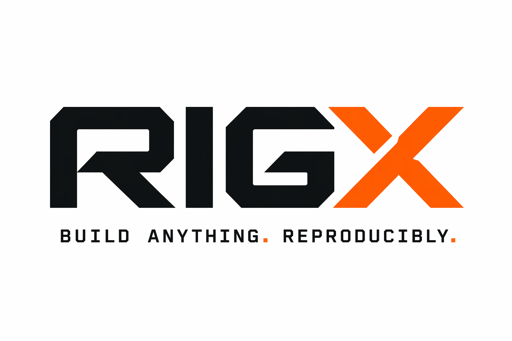

# rigx

<p align="center"></p>

> ⚠️ **Status: first release, experimental.** This is the initial version
> (`0.1.0`). APIs, the `rigx.toml` schema, and CLI behavior may change without
> notice. Use it, report issues, but don't rely on it for production builds
> yet.

A Nix-backed declarative minimalistic build system for human beings. Targets are described in `rigx.toml`. rigx generates a Nix flake, which drives sandboxed builds entirely through the Nix store. Build artifacts materialize only as symlinks under `output/`. No Nix knowledge or NixOS required, just Nix installed.

## Features

- **TOML target declarations**: inputs, outputs, internal and external deps.
- **External deps** via pinned `nixpkgs` or `git` flake inputs.
- **Lock file** (`flake.lock`) pins every input revision.
- **Sandboxed builds**: compilation never touches the local filesystem; each
  derivation runs against the Nix store's layered filesystem.
- **Outputs** only appear under `output/` as symlinks into the Nix store.
- **Parameterized targets** via variants (e.g. `debug` / `release`).
- **Multi-language**: C++, Nim, Python, Go (via `custom`), or any
  nixpkgs-supplied toolchain.

## Requirements

- [Nix](https://nixos.org/download) 2.4+ with flakes enabled (rigx passes
  `--extra-experimental-features "nix-command flakes"` automatically). This is
  the **only** tool you must install on the host — everything else
  (toolchains, `uv`, language-specific interpreters, …) comes from nixpkgs on
  demand and is pinned in `flake.lock`.

Python is provided by whatever channel you use to install rigx (PyPI install
methods manage it for you; nixpkgs brings it along automatically). For
generating Python `uv.lock` files you can run `rigx uv lock` — rigx pulls
`uv` from the project's pinned nixpkgs, no host install needed.

## Installation

### From PyPI

Pick whichever matches your toolchain. Nix is **not** bundled — if it isn't
already on your `PATH`, rigx prints install instructions the first time you run
`rigx build`.

**`uv tool install` (recommended — isolated, on your PATH):**
```
uv tool install rigx
```
Upgrade with `uv tool upgrade rigx`; remove with `uv tool uninstall rigx`.

**`pipx` (same idea, pipx-managed venv):**
```
pipx install rigx
```

**`pip` in a virtualenv:**
```
python3 -m venv .venv
. .venv/bin/activate
pip install rigx
```

**Ephemeral (run once without installing):**
```
uv tool run rigx -C ./example-project build    # uv
pipx run rigx -C ./example-project build       # pipx
```

On nixpkgs-Python systems you'll see an `externally-managed-environment` error
from a bare `pip install` — use one of the isolated methods above instead.

After installation, install Nix:
- macOS / Linux (official): `sh <(curl -L https://nixos.org/nix/install) --daemon`
- macOS / Linux (Determinate Systems): `curl --proto '=https' --tlsv1.2 -sSf -L https://install.determinate.systems/nix | sh -s -- install`

Restart your shell (or source `/nix/var/nix/profiles/default/etc/profile.d/nix-daemon.sh`), then confirm: `nix --version && rigx --help`.


## Usage

From a project directory containing `rigx.toml`:

```
rigx list                 # list targets
rigx lock                 # generate flake.nix and update flake.lock
rigx build                # build every target (and variant)
rigx build hello          # build one target
rigx build hello@release  # build a specific variant
rigx flake                # print generated flake.nix (for debugging)
rigx clean                # remove output/
rigx run publish          # execute a script-kind target (publish/deploy/etc.)
rigx run deploy -- --dry-run prod   # forward args after `--` as $1, $2, …
rigx uv lock              # run uv (from pinned nixpkgs) — e.g. to refresh uv.lock
```

If rigx isn't installed, invoke it as a module:
`PYTHONPATH=/path/to/rigx python3 -m rigx -C /path/to/project build`.

---

# `rigx.toml` reference

Every `rigx.toml` has a `[project]` section, an optional `[nixpkgs]` section,
an optional `[vars]` table, zero or more `[dependencies.git.*]` entries, and
one or more `[targets.*]`.

## Top-level sections

### `[project]`

```toml
[project]
name    = "myproject"        # required
version = "0.1.0"            # optional; default "0.0.0". Used as Nix derivation version.
```

### `[nixpkgs]`

```toml
[nixpkgs]
ref = "nixos-24.11"          # optional; default "nixos-24.11". Any nixpkgs branch, tag, or commit.
```

The revision is resolved into `flake.lock` on `rigx lock`.

### `[vars]`

Reusable list values shared between targets. Each entry must be a list of
strings. Reference one inside any list field with `"$vars.<name>"` — it
expands inline (the entry is replaced by the var's contents).

```toml
[vars]
common_sources = ["src/util.cpp", "src/log.cpp"]
cxx_deps       = ["fmt", "spdlog"]
opt_release    = ["-O2", "-flto"]

[targets.app]
kind          = "executable"
sources       = ["$vars.common_sources", "src/main.cpp"]
deps.nixpkgs  = ["$vars.cxx_deps"]

[targets.app.variants.release]
cxxflags = ["$vars.opt_release", "-DNDEBUG"]
```

- Expansion is **whole-element only**: `"prefix/$vars.x"` stays literal.
- Vars cannot reference other vars (one-pass resolution, no cycles).
- An undefined `$vars.<name>` is a config error.
- Works in every list field of a target or variant: `sources`, `includes`,
  `public_headers`, `cxxflags`, `ldflags`, `nim_flags`, `args`, `outputs`,
  `native_build_inputs`, and all three `deps.*` lists.

### `[dependencies.git.<name>]`

Declare external flake inputs. Referenced from targets via `deps.git = ["<name>"]`.

```toml
[dependencies.git.mylib]
url   = "https://github.com/someone/mylib"
rev   = "v1.0.0"             # branch / tag / 40-char commit SHA
flake = true                 # must be a flake in this version (default true)
attr  = "default"            # attribute inside packages.${system} (default "default")
```

## Targets

Every target lives under `[targets.<name>]` and has a `kind`.

**Source globs.** Entries in `sources` may use `*`, `**`, `?`, and `[…]`
patterns (Python `Path.glob` semantics). Globs are resolved against the
project root at config-load time, results are sorted for deterministic Nix
hashes, and a glob that matches no files is a config error. Literal entries
pass through unchanged, so you can mix them — useful when a kind treats
`sources[0]` as the entry point:

```toml
sources = ["src/main.cpp", "src/lib/**/*.cpp"]   # main.cpp stays first
```

Fields common to several kinds:

| Field                  | Type            | Purpose                                          |
|------------------------|-----------------|--------------------------------------------------|
| `kind`                 | string          | One of the kinds listed below. **Required.**     |
| `sources`              | list[string]    | Source files (paths or globs, relative to root). |
| `includes`             | list[string]    | Header / include search paths.                   |
| `cxxflags`             | list[string]    | Compiler flags (C/C++).                          |
| `ldflags`              | list[string]    | Linker flags (C/C++).                            |
| `defines`              | table           | Preprocessor defines: `{ DEBUG = "1" }`.         |
| `deps.internal`        | list[string]    | Other targets in this `rigx.toml`.               |
| `deps.nixpkgs`         | list[string]    | Nixpkgs attrs (e.g. `fmt`, `uv`, `go`).          |
| `deps.git`             | list[string]    | Names from `[dependencies.git.*]`.               |

### Variants — parameterized targets

Variants override/extend fields per configuration. Selected at the CLI as
`target@variant`.

```toml
[targets.hello.variants.debug]
cxxflags = ["-O0", "-g"]
defines  = { DEBUG = "1" }

[targets.hello.variants.release]
cxxflags = ["-O2"]
defines  = { NDEBUG = "1" }
```

- Variant fields **append** to the target's base `cxxflags` / `ldflags` /
  `nim_flags` and **merge over** `defines`.
- Variants produce independent Nix derivations (`hello-debug`, `hello-release`).
- `rigx build hello` builds all variants; the unqualified attribute
  aliases the alphabetically-first variant.

---

## Kinds

### `executable` — C/C++ program

```toml
[targets.hello]
kind     = "executable"
sources  = ["src/main.cpp"]
includes = ["include"]
cxxflags = ["-std=c++17", "-Wall"]
ldflags  = ["-lfmt"]                 # linker flags (e.g. -lNAME for nixpkgs libs)
deps.internal = ["greet"]            # static_library deps are linked in automatically
deps.nixpkgs  = ["fmt"]
```

- Output: `$out/bin/<name>` in the Nix store, symlinked to `output/<name>`.
- Linking: static_library internal deps are added to the link line as
  `${dep}/lib/lib<dep>.a`. Nixpkgs deps are added to `buildInputs` (their
  include/lib paths appear on `NIX_CFLAGS_COMPILE` / `NIX_LDFLAGS`); add
  `-l<name>` in `ldflags` to pick up a shared library by soname.

### `static_library` — C/C++ archive

```toml
[targets.greet]
kind           = "static_library"
sources        = ["src/greet.cpp"]
includes       = ["include"]
public_headers = ["include"]         # dirs whose contents are copied to $out/include
cxxflags       = ["-std=c++17", "-Wall"]
deps.nixpkgs   = ["fmt"]
```

- Output: `$out/lib/lib<name>.a` and `$out/include/<public_headers…>`.
- Downstream targets that list this in `deps.internal` automatically get the
  include path and the archive on the link line.

### `nim_executable` — Nim program

```toml
[targets.hello_nim]
kind         = "nim_executable"
sources      = ["src/hello.nim"]     # sources[0] is the entry point
nim_flags    = ["-d:release", "--opt:speed"]
defines      = { FEATURE_X = "1" }    # → -d:FEATURE_X=1
deps.nixpkgs = ["nim"]

[targets.hello_nim.variants.debug]
nim_flags = ["-d:debug", "--debugger:native"]
```

- Output: `$out/bin/<name>`.
- Runs `nim c <nim_flags> --nimcache:./nimcache --out:<name> <entry>`.
- `HOME` is redirected to `$TMPDIR` because stdenv's default is read-only.

### `python_script` — Python entry-point + uv-managed venv

```toml
[targets.greet_py]
kind            = "python_script"
sources         = ["src/greet.py"]   # sources[0] is the entry; all sources are bundled
python_version  = "3.12"             # → pkgs.python312 from nixpkgs
python_project  = "."                # dir with pyproject.toml + uv.lock (relative to root)
python_venv_hash = "sha256-..."      # optional; see workflow below
```

- Output: `$out/bin/<name>` — a launcher that invokes the pinned Python
  interpreter with the venv's `site-packages` prepended to `PYTHONPATH`,
  plus the entry script's directory.
- Dependencies come from `pyproject.toml` + `uv.lock`, **not** from
  `deps.nixpkgs`. `uv sync --frozen` runs inside a fixed-output derivation
  (FOD) that has network access for PyPI.

**`python_venv_hash` workflow** (optional but recommended):

1. Write `pyproject.toml` with your deps; run `rigx uv lock` (or `uv lock`
   if you have uv installed locally) to produce `uv.lock`.
2. First `rigx build <target>` fails with a hash-mismatch error:
   ```
   error: hash mismatch in fixed-output derivation ...
            specified: sha256-AAAAAAAAAAAAAAAAAAAAAAAAAAAAAAAAAAAAAAAAAAA=
               got:    sha256-<real-hash>
   ```
3. Paste the `got:` hash into `python_venv_hash` and rebuild.
4. When `uv.lock` changes, the hash changes — repeat.

If omitted, every build fails deterministically on hash mismatch.

### `run` — execute an artifact, capture its output files

```toml
# Invoke another target you built
[targets.greeting]
kind    = "run"
run     = "gen_greeting"             # internal target name
args    = ["--name", "Massimo", "--out", "greeting.txt"]
outputs = ["greeting.txt"]           # files (or directories) captured to $out/

# Invoke a nixpkgs tool from PATH
[targets.headers_zip]
kind         = "run"
run          = "zip"                 # not an internal target → looked up on PATH
deps.nixpkgs = ["zip"]               # supplies zip on PATH in the sandbox
args         = ["-r", "headers.zip", "include"]
outputs      = ["headers.zip"]

# Consume another run target's artifact via Nix interpolation
[targets.unpack_headers]
kind           = "run"
run            = "unzip"
deps.nixpkgs   = ["unzip"]
deps.internal  = ["headers_zip"]     # declare the build-order dep
args           = ["-d", "extracted", "${headers_zip}/headers.zip"]
outputs        = ["extracted"]       # directory; cp -r handles it
```

- `run` resolves as an internal target first (`${name}/bin/<name>`), otherwise
  as a bare command looked up on PATH. Use `deps.nixpkgs` to supply PATH tools.
- `args` are shell-quoted by rigx. `${other_target}` inside an arg is a
  Nix interpolation that expands to the dependency's store path at flake
  evaluation time.
- `outputs` are captured with `cp -r`, so directories work.

### `custom` — user-supplied build/install scripts (escape hatch)

```toml
[targets.hello_go]
kind         = "custom"
deps.nixpkgs = ["go"]
build_script = """
export GOCACHE=$TMPDIR/go-cache
export GOPATH=$TMPDIR/go
go build -o hello_go src/hello.go
"""
install_script = """
mkdir -p $out/bin
cp hello_go $out/bin/
"""
# native_build_inputs = ["makeWrapper"]   # optional; mapped to nativeBuildInputs
```

- `install_script` is required; `build_script` is optional.
- Scripts run in a standard Nix stdenv sandbox with `src` already unpacked
  and the cwd set to the source root. `$out`, `$TMPDIR`, `$HOME` are available
  (stdenv's default `HOME=/homeless-shelter` is read-only — redirect it for
  tools like Go, Cargo, Nim that want a writable home).
- All `deps.*` entries end up on `buildInputs`, so their binaries are on
  PATH and their libraries/headers are on the usual compile/link paths.
- Literal `${` inside a script must be written as `''${` (Nix indented-string
  escape) because `${var}` is interpreted by Nix.

### `script` — host-side task (publish, deploy, release)

```toml
[targets.publish]
kind         = "script"
deps.nixpkgs = ["uv"]
script = """
rm -rf dist
uv build
uv publish
"""
```

Unlike every other kind, a `script` target **runs on the host**, not inside
a Nix build sandbox. It executes via `nix shell nixpkgs/<pinned-ref>#<deps> --
command bash -eo pipefail -c "<script>"` in the project root.

**Invoke with `rigx run`, not `rigx build`:**
```
rigx run publish
rigx run publish -- --dry-run prod    # extra args become $1, $2, … in the script
```
Script targets produce no artifact and therefore aren't buildable. If you name
one in `rigx build`, you'll get an error pointing at `rigx run`.

Anything after `--` is forwarded to the script as positional arguments — use
`"$@"` (or `$1`, `$2`, …) inside the `script` body to consume them. The target
name is `$0`. Without `--`, the script runs with no extra arguments.

- Intended for side-effecting tasks: publishing, deploying, pushing images,
  running end-to-end tests against real systems.
- `deps.nixpkgs` tools come from the project's pinned nixpkgs, so the
  environment is still reproducible even though the script is not sandboxed.
- Excluded from `rigx build` entirely — they're listed by `rigx list` for
  discoverability but only runnable via `rigx run`.
- Produces no `output/<target>` symlink — side effects happen in place.
- Variants, `$out`, and the Nix store are not available — the script runs as
  a plain bash `-eo pipefail` block in your current shell environment (with
  tools on PATH, `$HOME`, etc.).

Credentials needed by the script (`UV_PUBLISH_TOKEN`, cloud CLI creds, SSH
keys, …) are read from your shell environment — set them before invoking
`rigx run <target>`.

---

## Complete example (matches `example-project/rigx.toml`)

```toml
[project]
name    = "hello-example"
version = "0.1.0"

[nixpkgs]
ref = "nixos-24.11"

# C++ static library
[targets.greet]
kind           = "static_library"
sources        = ["src/greet.cpp"]
includes       = ["include"]
public_headers = ["include"]
cxxflags       = ["-std=c++17", "-Wall"]
deps.nixpkgs   = ["fmt"]

# C++ executable with two variants
[targets.hello]
kind          = "executable"
sources       = ["src/main.cpp"]
includes      = ["include"]
cxxflags      = ["-std=c++17", "-Wall"]
ldflags       = ["-lfmt"]
deps.internal = ["greet"]
deps.nixpkgs  = ["fmt"]

[targets.hello.variants.debug]
cxxflags = ["-O0", "-g"]
defines  = { DEBUG = "1" }

[targets.hello.variants.release]
cxxflags = ["-O2"]
defines  = { NDEBUG = "1" }

# Nim executable with variants
[targets.hello_nim]
kind         = "nim_executable"
sources      = ["src/hello.nim"]
nim_flags    = ["-d:release", "--opt:speed"]
deps.nixpkgs = ["nim"]

[targets.hello_nim.variants.debug]
nim_flags = ["-d:debug", "--debugger:native"]

[targets.hello_nim.variants.release]
nim_flags = ["-d:release", "--opt:speed"]

# Python script with uv-managed dependencies
[targets.greet_py]
kind           = "python_script"
sources        = ["src/greet.py"]
python_version = "3.12"
python_project = "."
# python_venv_hash = "sha256-..."   # fill in after first build error

# Build tool (codegen)
[targets.gen_greeting]
kind     = "executable"
sources  = ["src/gen_greeting.cpp"]
cxxflags = ["-std=c++17"]

# Run target that invokes an internal executable
[targets.greeting]
kind    = "run"
run     = "gen_greeting"
args    = ["--name", "Massimo", "--out", "greeting.txt"]
outputs = ["greeting.txt"]

# Run target using a nixpkgs tool (zip) from PATH
[targets.headers_zip]
kind         = "run"
run          = "zip"
deps.nixpkgs = ["zip"]
args         = ["-r", "headers.zip", "include"]
outputs      = ["headers.zip"]

# Run target consuming another run target's artifact
[targets.unpack_headers]
kind          = "run"
run           = "unzip"
deps.nixpkgs  = ["unzip"]
deps.internal = ["headers_zip"]
args          = ["-d", "extracted", "${headers_zip}/headers.zip"]
outputs       = ["extracted"]

# Custom kind: unsupported language (Go) via user-supplied scripts
[targets.hello_go]
kind         = "custom"
deps.nixpkgs = ["go"]
build_script = """
export GOCACHE=$TMPDIR/go-cache
export GOPATH=$TMPDIR/go
go build -o hello_go src/hello.go
"""
install_script = """
mkdir -p $out/bin
cp hello_go $out/bin/
"""
```

## Running the tests

From the repo root, with stdlib `unittest`:

```
python3 -m unittest discover tests -v
```

Tests are Nix-free: they exercise the TOML parser, validator, Nix-flake text
generator, and builder attribute resolution without invoking `nix` or touching
the network.

## Example project

See `example-project/` for a working version of the above.

```
cd example-project
rigx build hello@release
./output/hello-release/bin/hello "friend"
```

## License

BSD 2-Clause License. See [`LICENSE.md`](LICENSE.md) for the full text.

## Credits

Created by Massimo Di Pierro &lt;massimo.dipierro@gmail.com&gt; in collaboration
with Claude and ChatGPT (the author's own accounts), in his own free time, for
the greater good.
